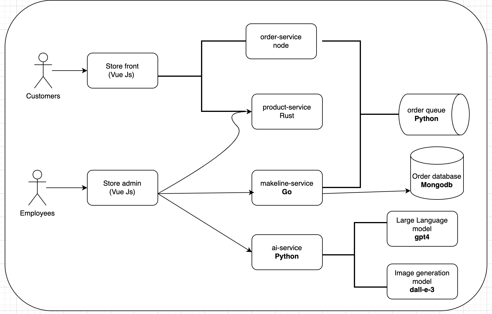
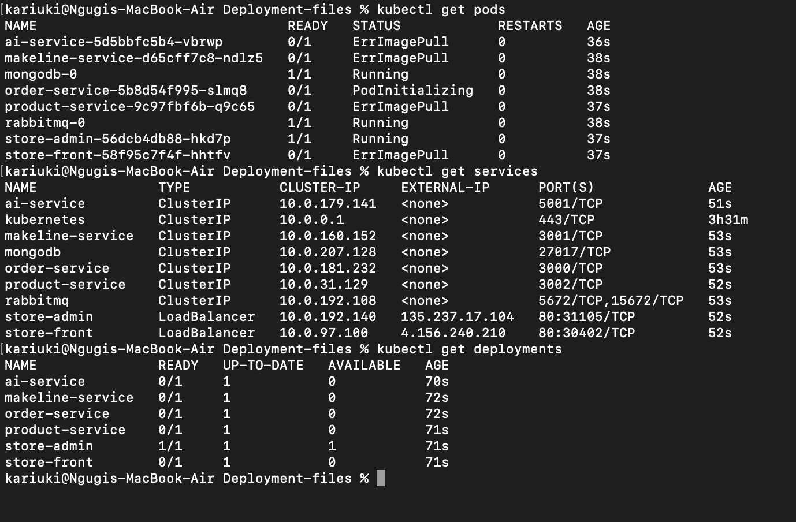

# BestBuy Store 
This sample demo app consists of a group of containerized microservices that can be easily deployed into a Kubernetes cluster. The application is a simple e-commerce store, where users can browse products, add them to their cart, and checkout. The application is built using Python, Flask, and Docker. It also usees open source back-end services (eg - RabbitMQ, MongoDB). The application also leverages OpenAI's models to generate product descriptions and images.

## Objectives
1. Deploy Best-buy application to a kubernetes cluster
2. Configure and manage essential Kubernetes resources like StatefulSets, Secrets, ConfigMaps, andDeployments.
3. Test the application's features, including backend services, frontend interfaces, and AI integration.

## Architecture

## Step 1
Creating docker containers for each microservice
### Product-service
Hosts all the products that will be displayed on the website
### Order-service
Handles all the order related operations
### Store-front-service
This is the front end service of the application
### Store-Admin-service
This is the admin panel of the application where the admin can add products, manage orders etc.
### Makeline-service
This service is used to 
### AI-service
This service is used to generate product descriptions and images
### databases
This service is used to store all the data of the application 
We are using MongoDB for storage and RabbitMQ for message queueing.

## Step 2
Set up the AKS cluster
1. Create a resource group
2. Created an Azure Kubernetes Service (AKS) cluster  `BestBuyStore`
3. Set up a master and worker node
4. Configured manual scaling for both nodes
5. Deployed the AKS cluster

### Connect the AKS cluster
1. login to azure account 

```bash
az login
```
2. Set the subscription

```bash
az account set --subscription 'subscribtion-id'
```
3. Configure kubectl

```bash
az aks get-credentials --resource-group BestBuyStore --name BestBuyStoreCluster
```
4. Verify cluster access

```bash
kubectl get nodes
```
## Step 3 
Setting up AI backing service by implementing the AI services and deploying them through Azure Ai services

1. **Create a new Azure AI service**
2. **Create a new AI model**
    Here we create both gpt 4.0 and dall-e-3 models

3. **Deploy the models**
4. **Note down the following details**
- Deployment name
- endpoint link
- key

### Configure API keys
1. Get your API keys
2. Base64 Encode the API keys

```bash
echo -n "<your-api-key>" | base64
```

## Step 4
1. In your secret.yaml file, add the following details
```bash

```
2. Deploy configMap and Secrets which will be used to connect to the Azure AI service
- Deploy ConfigMap.yaml

```bash
kubectl apply -f config-maps.yaml
```

- Deploy secret
```bash
kubectl apply -f secrets.yaml
```

- Verify deploy by checking your kubernetes extension on github

## Step 5
This step involves deploying the all in one application yaml file

1. **Apply the yaml file**

```bash
kubectl apply -f aps-all-in-one.yaml
```
2. **Verify the deployment**

```bash
kubectl get pods
```

3. Check services

```bash
kubectl get services
```

## Step 6

## Resources

### Docker hub links
| **Service Name**       | **Docker Hub Link**                                                                                         |
|------------------------|-------------------------------------------------------------------------------------------------------------|
| ai-service             | [https://hub.docker.com/repository/docker/kariukii/ai-service-l8/general](https://hub.docker.com/repository/docker/kariukii/ai-service-l8/general) |
| product-service        | [https://hub.docker.com/repository/docker/kariukii/product-service-l8/general](https://hub.docker.com/repository/docker/kariukii/product-service-l8/general) |
| store-front            | [https://hub.docker.com/repository/docker/kariukii/store-front-l8/general](https://hub.docker.com/repository/docker/kariukii/store-front-l8/general) |
| store-admin            | [https://hub.docker.com/repository/docker/kariukii/store-admin-l8/general](https://hub.docker.com/repository/docker/kariukii/store-admin-l8/general) |
| makeline-service       | [https://hub.docker.com/repository/docker/kariukii/makeline-service-l8/general](https://hub.docker.com/repository/docker/kariukii/makeline-service-l8/general) |
| order-service          | [https://hub.docker.com/repository/docker/kariukii/order-service-l8/general](https://hub.docker.com/repository/docker/kariukii/order-service-l8/general) |

### Github repos
| **Service Name**       | **GitHub Repository Link**                                                                               |
|------------------------|---------------------------------------------------------------------------------------------------------|
| store-front            | [https://github.com/Elikariuki/store-front-L8.git](https://github.com/Elikariuki/store-front-L8.git)     |
| store-admin            | [https://github.com/Elikariuki/store-admin-L8.git](https://github.com/Elikariuki/store-admin-L8.git)     |
| order-service          | [https://github.com/Elikariuki/order-service-L8.git](https://github.com/Elikariuki/order-service-L8.git) |
| makeline-service       | [https://github.com/Elikariuki/makeline-service-L8.git](https://github.com/Elikariuki/makeline-service-L8.git) |
| product-service        | [https://github.com/Elikariuki/product-service-L8.git](https://github.com/Elikariuki/product-service-L8.git) |
| ai-service             | [https://github.com/Elikariuki/ai-service-L8.git](https://github.com/Elikariuki/ai-service-L8.git)       |


## Challenges
1. Deploying the dall-e AI got an error of insufficient quota for all refions hence unable to deploy the service - fixed
2. image pulling on dockerhub - unable to pull the images from dockerhub due to default build settings to arm instead of x86. -fixed
3. Version control on requirements.txt - fixed 


## Demo video
This is the demo video of the application:
https://algonquinlivecom-my.sharepoint.com/:v:/g/personal/kari0117_algonquinlive_com/ERSRhRl1UapOlBdtc9FayG4BdyQxfaHxuICZqHXS_Bhhsg?e=7awuO1